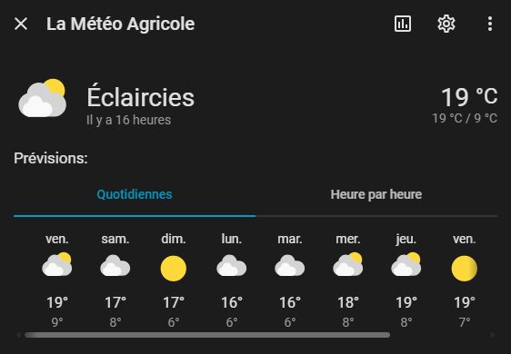
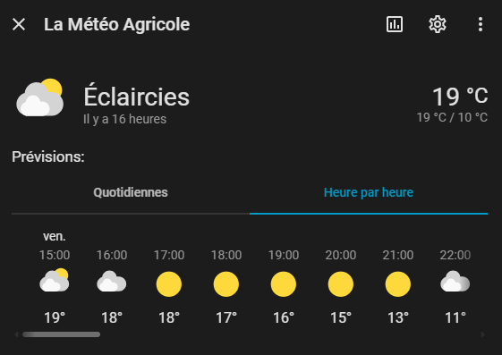

#  La Météo Agricole pour Home Assistant

Une intégration non officielle pour Home Assistant permettant de récupérer les données météorologiques ultra-locales depuis le site [La Météo Agricole](https://www.lameteoagricole.net/).

Contrairement aux modèles météo globaux, cette intégration extrait les prévisions spécifiques à votre position GPS (températures, vent, précipitations), idéales pour la domotique de précision, l'arrosage ou la gestion des volets.

---

## ✨ Fonctionnalités

Cette intégration crée une entité native `weather` complète dans votre Home Assistant, incluant :

* **🌡️ Conditions Actuelles :** Température en temps réel, vitesse du vent et état du ciel.
* **📅 Prévisions Quotidiennes (10 jours) :** * Températures Minimales et Maximales.
    * Volume de précipitations prévues (en mm).
    * Probabilité de pluie (en %).
* **⏱️ Prévisions Horaires :** Évolution de la température et de l'état du ciel heure par heure.
* **⚙️ Architecture Optimisée :** Utilisation d'un Coordinateur de Données (DataUpdateCoordinator) pour regrouper les requêtes web et préserver les serveurs du site distant. Mise à jour toutes les 30 minutes.

---

## 🚀 Installation

### Méthode 1 : Via HACS (Recommandée)

Puisque cette intégration n'est pas (encore) dans le dépôt par défaut de HACS, vous devez l'ajouter en tant que dépôt personnalisé :

1. Ouvrez Home Assistant et accédez à **HACS** > **Intégrations**.
2. Cliquez sur les **3 petits points** en haut à droite > **Dépôts personnalisés**.
3. Remplissez les champs :
   * **Dépôt :** `https://github.com/Mika-Indusapp/meteo_agricole_ha`
   * **Catégorie :** `Intégration`
4. Cliquez sur **Ajouter**.
5. Cherchez "La Météo Agricole" dans HACS et cliquez sur **Télécharger**.
6. **Redémarrez** votre Home Assistant.

### Méthode 2 : Manuelle

1. Téléchargez la dernière *Release* depuis ce dépôt GitHub.
2. Extrayez le dossier `meteo_agricole` et placez-le dans le dossier `custom_components/` de votre Home Assistant.
3. **Redémarrez** Home Assistant.

---

## ⚙️ Configuration

La configuration se fait entièrement via l'interface graphique (UI), aucune ligne de code YAML n'est requise !

1. Allez dans **Paramètres** > **Appareils et services**.
2. Cliquez sur **+ Ajouter une intégration** en bas à droite.
3. Cherchez **La Météo Agricole**.
4. Saisissez vos coordonnées :
   * **Latitude** (ex: `47.6476`)
   * **Longitude** (ex: `-2.7695`)
5. Validez. Votre nouvelle entité météo est prête à être ajoutée à votre tableau de bord !

---

## 📸 Captures d'écran

Aperçu de la carte météo native avec les prévisions quotidiennes et horaires :

---

## ⚠️ Avertissement et Crédits

Ce projet est une intégration tierce développée à des fins pédagogiques et personnelles. 
* Toutes les données météorologiques appartiennent au site [La Météo Agricole](https://www.lameteoagricole.net/). 
* Le rythme de rafraîchissement est fixé à 30 minutes pour respecter la charge de leurs serveurs. Merci de ne pas modifier ce paramètre de manière agressive sous peine de voir votre adresse IP bannie par leur pare-feu.
* Si vous appréciez la précision de leurs données, n'hésitez pas à visiter leur site web !

---
*Développé avec passion pour la communauté Home Assistant.*
